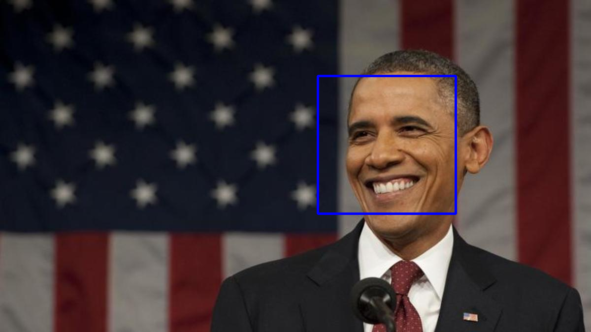

# facial-recognition

> A simple facial recognition script using OpenCV

##  Installation
```
pip install
```

### Clone
- Clone this repo to your local machine using `https://github.com/gurveerdhindsa/facial-recognition.git`

### Run
```
python main.py
```

##  Tech stack
- Python (OpenCV)


##  Support
- Website at <a href="https://gurveerdhindsa.github.io/portfolio/" target="_blank">`gurveerdhindsa.github.io`</a>
